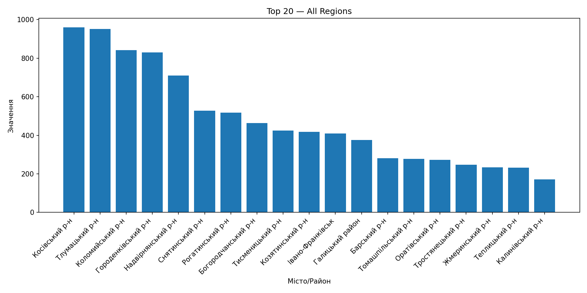

# 🇺🇦 CSV Bar Chart (Python)

A Python project that reads a CSV/TSV file with Ukrainian regional data (`Область`, `Місто/Район`, `Значення`)  
and visualizes it as a bar chart using **Pandas** and **Matplotlib**.

---

## ✨ Features
- Automatic CSV/TSV delimiter detection
- CLI options: `--region`, `--top`, `--sep`, `--horizontal`
- Saves chart to `charts/bar_chart.png`
- Works with UTF-8 encoded Ukrainian data

---

## 🚀 Quick Start
bash
git clone https://github.com/Profy8712/csv-bar-chart-py.git
cd csv-bar-chart-py
python -m venv venv
source venv/Scripts/activate  # for Windows
pip install -r requirements.txt
python main.py --csv input_data.csv --region "Київська" --top 10 --horizontal
ain.py --csv input_data.csv --region "Київська" --top 10

## 📊 Example Output

Below is an example bar chart generated from `input_data.csv`:

